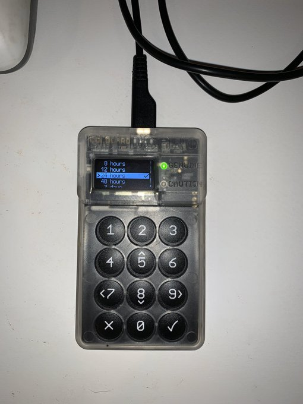
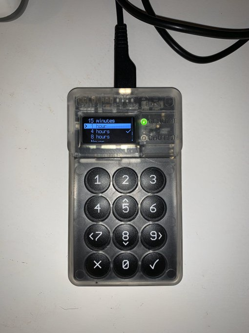

#9: Time management allows you to Set a delayed start after your PIN is entered, i.g., user must wait 24 hours after correct PIN is entered before access is granted. You can also set it to shut down after a certain idle time like 1 hour.

