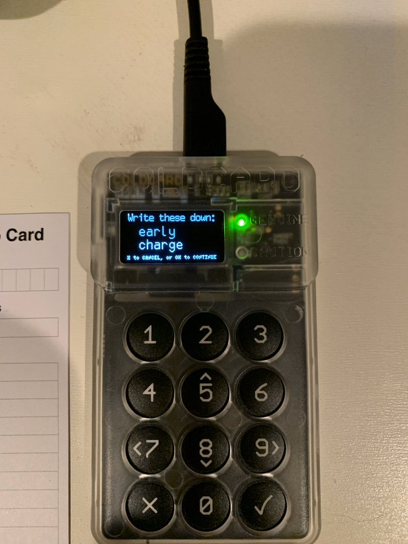

#8: Secure PIN - PINs can be 12 digits, split into prefix & suffix. The secure element key & prefix create anti-phishing words using HMAC/SHA256 function where the 22 bit HMAC result is converted into two BIP39 English words.

