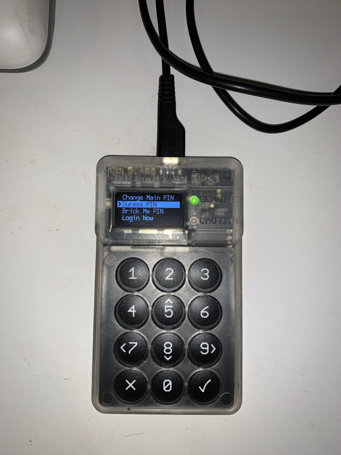

#7: Auxiliary PINs - You can create a decoy wallet that is accessed with a special duress PIN. You can also create a PIN that, when entered, destroys the ColdCard within 50ms. Functionality appears the same to user regardless of PIN used. There are no special warnings.

