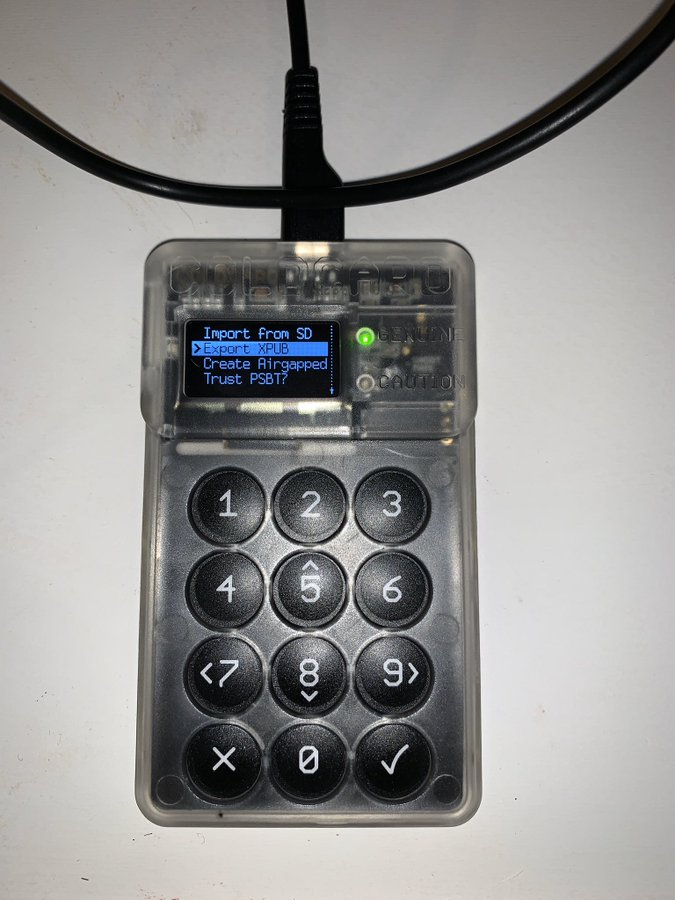

#5: BIP 174 Support - You can create multi-sig wallets 100% air-gapped by using multiple ColdCards & passing a microSD card between them for the xPUBs. You can also sign a PSBT file on MicroSD, load it into BitcoinCore, & broadcast it from your own node w/o connecting your wallet

