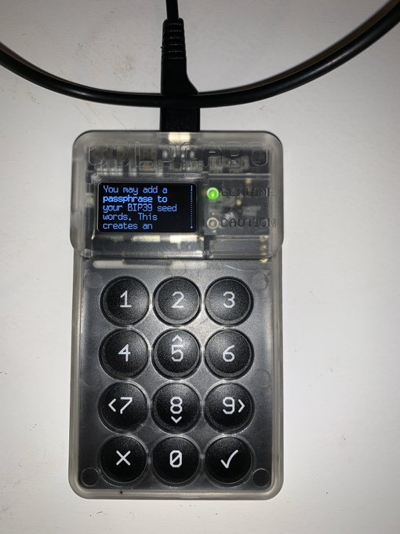
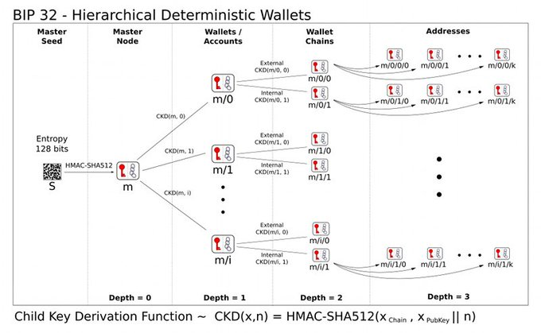

#4: BIP 39 Support - Your mnemonic seed is only 24 of 2048 English words. Add a 25th word (passphrase) up to 100 characters in length. Derives your xPRV with a HMAC/SHA512 function for BIP 32 HD wallet address generation.

