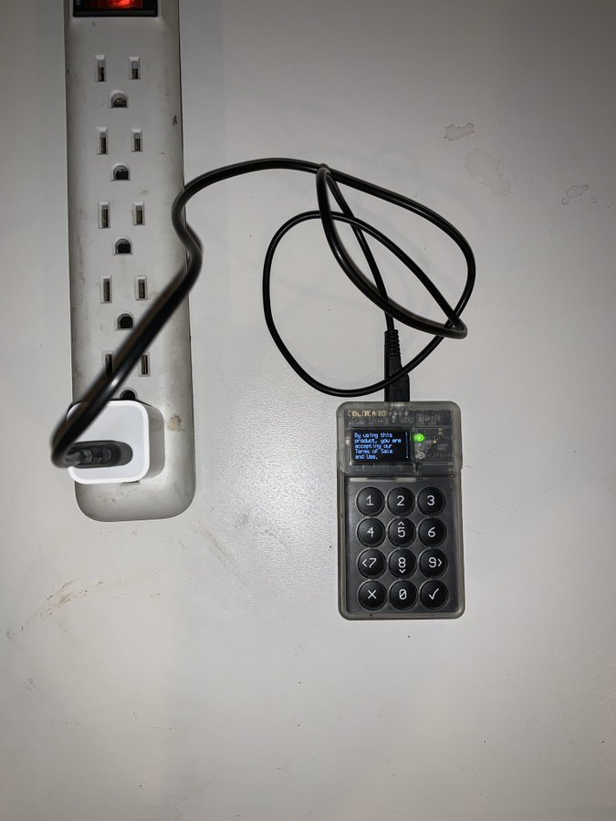

#3: 100% Air-gapped means You never have to connect your ColdCard to a computer. You can power it with a wall charger or battery pack and still generate wallet addresses, sign transactions, & update firmware. All offline and with MicroSD card use.

