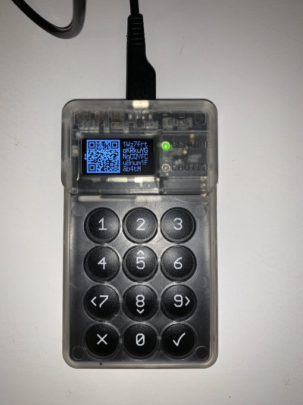
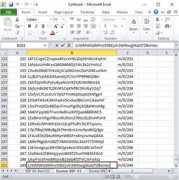

#2: Multiple Address Types Supported - Your ColdCard can generate BIP 43, BIP 44 non-SegWit, BIP 49 SegWit, & BIP 84 Bech32 wallet addresses. You can export 250 addresses at a time in CSV format .txt files onto your MicroSD card. Plus it generates QR codes!

