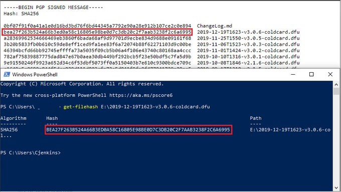
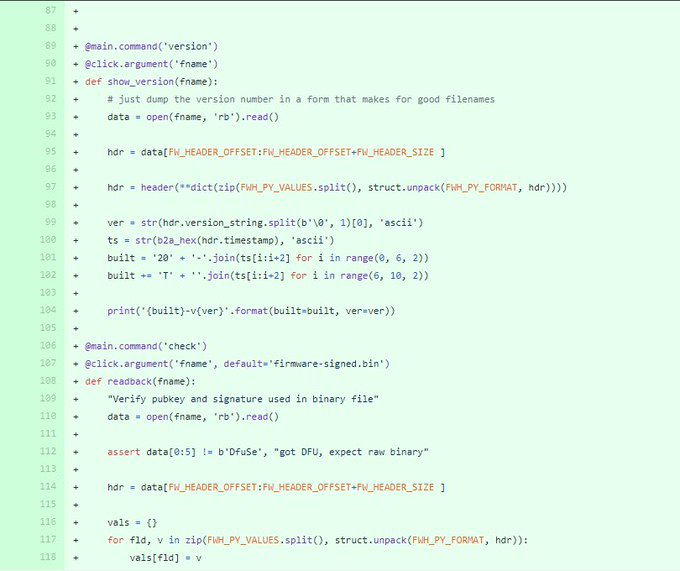
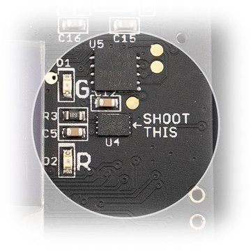
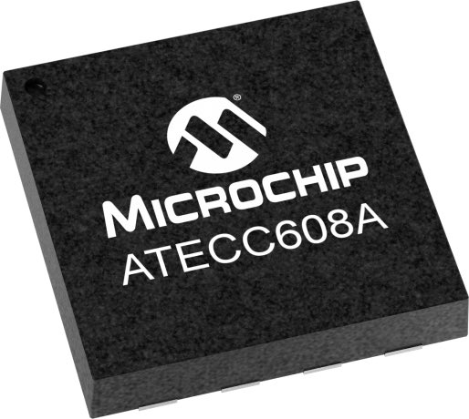

#1: Source viewable - You can download the latest firmware .dfu file, verify it with GPG key & sha256 hash, load it on MicroSD card, & don't trust, verify. You can also step through all the code on github. This was originally an open-source project when this post was created in January 2020 but that has been changed to source viewable. You can learn more about what Free & Open-Source Software (FOSS) means [here](https://en.wikipedia.org/wiki/Free_and_open-source_software).

Bonus: The ATECC608A Chip - Your xPRV is stored here. It has a secure boot feature & was designed to resist advanced aggressive attacks such as: Fault Injection, Timing Analysis, Side Channel Analysis, & Probing. Can store up to 16 keys. Independently bricks itself after 13 tries.

Thanks for reading! I hope you will take some of these features into consideration when trying to decide the best way to self custody your bitcoin. 
