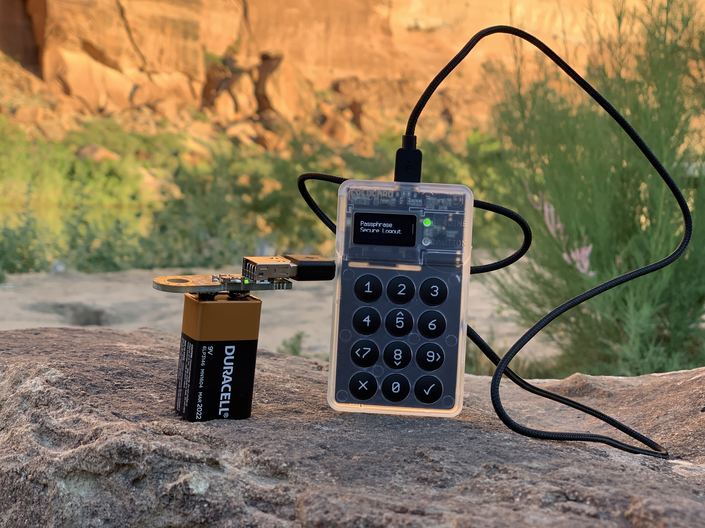

# My-Top-10-Coldcard-Features
10 Things I like about the [ColdCard](https://coldcard.com/) wallet by [CoinKite](https://coinkite.com/). From functioning 100% offline to displaying QR codes, this Bitcoin only wallet has it all.

Early on in my journey down the Bitcoin rabbit hole, I realized that self custody was the only way to know for sure if I owned my bitcoin or not. Self custody sounded daunting at that stage, I didn't really know how it worked or what a lot of terms meant. But the way I learn best is through hands on experience. 

Fast forward to today and you'll hear companies like PayPal advising their customers that self custody is risky and dangerous. Well, in my opinion, the alternatives to self custody pose much greater threats. Companies like PayPal have a vested interest in separating people from self custody of their bitcoin. After all, PayPal just recently invested $4.2M in the chain analysis firm [TRM Labs](https://www.pymnts.com/news/investment-tracker/2019/trm-labs-raises-4-2m-in-funding-led-by-paypal-ventures/). TRM Labs by the way, just hired former FinCEN advisor, [Ari Redbord](https://www.coindesk.com/paypal-backed-blockchain-analytics-firm-hires-former-us-treasury-adviser), which should make it painfully obvious that companies like PayPal are more interested in government compliance and neutering the true value proposition of Bitcoin than they are interested in looking out for their customer's best interest and harnessing the power of unstoppable transactions.  

The less bitcoin people take into self custody, the easier it is to control and dictate how it's used. One of the best parts about Bitcoin is that it is permission-less, I can send or receive it anywhere in the world, anytime, and to any entity I choose, regardless of OFAC lists, banking hours, or transactions limits which are all found in the legacy financial system. When someone else holds your bitcoin for you, then you have to ask them permission to interact with it. If they don't like who you want to send a payment to then they can stop you. Taking bitcoin into self custody ensures that you own "fuck-you-money" not "may-I-money".

##     Enter ColdCard wallet, it had everything I was looking for in a safe place to self custody my bitcoin. 
